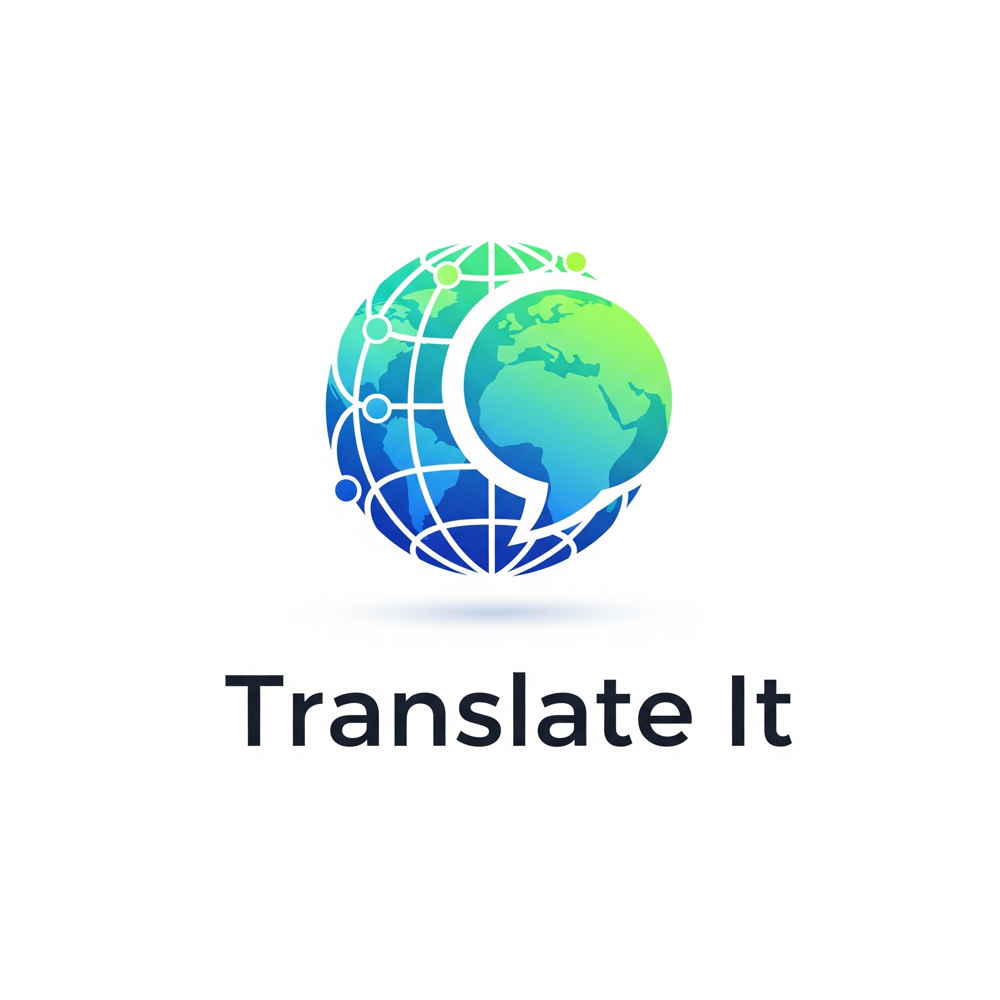

# 🌐 Translate It — CodeAlpha Internship Project

As part of my internship at **Code Alpha**, I developed **"Translate It" v1**, a mobile application that provides multilingual text translation and speech output.

 <!-- Replace with actual image path or URL -->

---

## ✨ Features

* 🌍 **Translate between multiple languages**:

  | Code      | Language             |
  | --------- | -------------------- |
  | `en`      | English              |
  | `ar`      | Arabic               |
  | `fr`      | French               |
  | `de`      | German               |
  | `es`      | Spanish              |
  | `zh-Hans` | Chinese (Simplified) |
  | `ja`      | Japanese             |

* 🔊 **Text-to-Speech (TTS)**: Listen to translated text.

* 📋 **Quick actions**: Easily copy and paste text.

---

## ⚙️ How It Works

1. ✅ Created **Azure Translator** and **Resource Group** in *North Italy* region.
2. 🧪 Tested API using simple Python `requests` script.
3. 📱 Integrated the API into the Android application.
4. 🔈 Implemented TTS using Android’s built-in `TextToSpeech` engine.

---

## 🛠 Tools & Tech Stack

* **Android** (Kotlin)
* **Azure Cognitive Services** (Translator API)

---

## ⚠️ Notes

* This is a **basic demo version** using a free Azure resource.
* API keys were **not secured** in the first version (now deleted).
* For production, I should make more approaches for this like backend 
* Azure’s scalable plans make it easy to upgrade for deployment.

